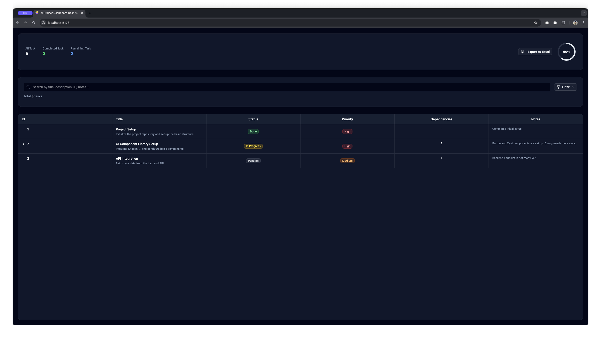

# AreYouJ

**A web-based dashboard for AI-assisted project management with real-time Claude integration**

> **Why "AreYouJ"?** 🤔  
> In Korea, people often ask "너 J야?" (Are you J?) when someone shows highly organized and planning-oriented behavior, referencing the MBTI J trait. This project embodies that same systematic, planning-focused approach—helping you manage AI-driven workflows with the methodical precision of a true J personality type.

Modern task management dashboard with direct Claude CLI integration. Track tasks, interact with Claude in real-time, and manage AI-generated project workflows seamlessly.



## 🚀 Quick Start

### Prerequisites

- **Node.js** 18+
- **Claude Code** installed and configured (`npm install -g @anthropic-ai/claude-code`)
- **Python 3.7+** (for PTY wrapper)

> **Windows Users**: See [WINDOWS_SETUP.md](./WINDOWS_SETUP.md) for WSL-based installation guide

### Installation & Launch

```bash
# Clone the repository
git clone https://github.com/Momentum96/AreYouJ.git
cd AreYouJ

# Install dependencies
npm install

# Start the full application (recommended)
npm run dev:full
# This runs both the web dashboard and backend server

# Or run components separately:
npm run dev        # Frontend only (localhost:5173)
npm run dev:server # Backend only (localhost:3001)
```

### First Steps

1. **Open Dashboard**: Visit `http://localhost:5173`
2. **Check Claude Connection**: Look for the green WiFi icon in the Automation tab
3. **Send a Message**: Try "Hello Claude, create a simple project plan"
4. **View Results**: Watch real-time output in the terminal area

## 🏗️ Architecture Overview

This is a **full-stack web application** with Claude CLI integration:

```
┌─────────────────┐    ┌──────────────────┐    ┌─────────────────┐
│   React Client  │◄──►│   Express Server │◄──►│   Claude CLI    │
│   (Dashboard)   │    │  (API + WebSocket)│    │ (Python PTY)    │
└─────────────────┘    └──────────────────┘    └─────────────────┘
```

### Core Components

- **Frontend**: React 19 + TypeScript + Tailwind CSS (Vite)
- **Backend**: Express.js server with WebSocket support
- **Claude Integration**: Python PTY wrapper for seamless Claude CLI communication
- **Task Management**: JSON-based task storage with real-time updates
- **Real-time Communication**: WebSocket for live Claude terminal output

## ✨ Key Features

### 🤖 Claude Integration

- **Direct CLI Connection**: Real-time communication with Claude CLI via Python PTY
- **Live Terminal Output**: Watch Claude's responses stream in real-time with ANSI color support
- **Message Queue System**: Persistent queue for handling multiple Claude interactions
- **Auto-Session Management**: Automatic Claude session startup and recovery

### 📊 Task Management Dashboard

- **Real-time Task Tracking**: Auto-sync with `docs/tasks.json` changes
- **Advanced Filtering**: Filter by status, priority, assignee, and search terms
- **Progress Visualization**: Animated counters and circular progress indicators
- **Task Details Modal**: Rich task information with subtask management
- **Excel Export**: Export filtered task data to Excel format

### 🔧 Developer Experience

- **Hot Reload**: Instant updates during development
- **WebSocket Communication**: Real-time updates between frontend and backend
- **Error Recovery**: Robust error handling with automatic retries
- **Debug Logging**: Comprehensive logging for troubleshooting
- **Modern Stack**: Built with latest React 19, TypeScript, and Tailwind CSS

## 🎯 Usage Scenarios

### Project Planning with Claude

```
You: "Help me create a development plan for a React dashboard project"
Claude: [Generates structured project breakdown]
Result: Automatically updates tasks.json with actionable items
```

### Real-time Development Assistance

```
You: "Review my component architecture and suggest improvements"
Claude: [Analyzes code and provides feedback]
Dashboard: Shows updated task list with improvement suggestions
```

### Progress Tracking

```
You: "Mark user authentication as completed and create next steps"
Claude: [Updates project status and generates follow-up tasks]
Dashboard: Reflects changes immediately with visual progress updates
```

## 🛠️ Development Scripts

```bash
# Development (recommended - runs both frontend and backend)
npm run dev:full

# Frontend only
npm run dev              # Vite dev server on :5173

# Backend only
npm run dev:server       # Express server on :3001 with nodemon

# Production
npm run build            # Build for production
npm start               # Run production server

# Maintenance
npm run cleanup         # Clean up server processes and logs
npm run lint           # ESLint code checking
```

## 📁 Project Structure

```
AreYouJ/
├── 🌐 Frontend (React + TypeScript)
│   ├── src/
│   │   ├── components/
│   │   │   ├── Dashboard.tsx       # Main task dashboard
│   │   │   ├── Automation.tsx      # Claude integration UI
│   │   │   ├── TaskTable.tsx       # Task list with filtering
│   │   │   └── ui/                 # Reusable UI components
│   │   ├── hooks/                  # Custom React hooks
│   │   ├── utils/
│   │   │   ├── api.ts              # API client for backend
│   │   │   ├── websocket.ts        # WebSocket connection
│   │   │   └── claude-terminal.js   # Terminal output renderer
│   │   └── types/                  # TypeScript definitions
│   └── vite.config.ts              # Vite configuration
│
├── 🔧 Backend (Express + WebSocket)
│   ├── server/
│   │   ├── index.js                # Main Express server
│   │   ├── routes/api.js           # REST API endpoints
│   │   ├── websocket/index.js      # WebSocket server
│   │   ├── claude/
│   │   │   ├── claude_pty_wrapper.py  # Python PTY bridge
│   │   │   └── session-manager.js     # Claude session handling
│   │   └── data/queue.json         # Persistent message queue
│   └── nodemon.json                # Development auto-restart config
│
├── 📄 Configuration & Data
│   ├── docs/
│   │   ├── tasks.json              # Task data (AI-generated)
│   │   └── PROJECT_ANALYSIS.md     # Project documentation
│   ├── prompt/                     # AI prompts for manual copy
│   └── package.json                # Dependencies and scripts
└── 🎨 Styling & Build
    ├── tailwind.config.js          # Tailwind CSS configuration
    ├── components.json             # Shadcn/UI component config
    └── tsconfig.json              # TypeScript configuration
```

## 🔗 AI Integration Options

### Built-in Claude Integration (Recommended)

- **Direct CLI**: Native Claude CLI integration via PTY wrapper
- **Real-time**: Live terminal output with ANSI support
- **Persistent**: Message queue survives server restarts
- **Automatic**: Auto-starts Claude sessions

### Manual AI Tools Integration

For other AI tools, copy prompts from the `prompt/` folder:

| AI Tool            | Usage Method               | Auto-Applied |
| ------------------ | -------------------------- | ------------ |
| **Claude Code**    | Built-in integration       | ✅ Native    |
| **Claude CLI**     | Built-in integration       | ✅ Native    |
| **Cursor**         | Copy from `prompt/` folder | ❌ Manual    |
| **ChatGPT**        | Copy from `prompt/` folder | ❌ Manual    |
| **GitHub Copilot** | Copy from `prompt/` folder | ❌ Manual    |

## 🚀 Deployment

### Production Build

```bash
npm run build     # Build React app for production
npm start         # Start production Express server
```

### Environment Variables

Create a `.env` file for production configuration:

```env
NODE_ENV=production
PORT=3001
CLAUDE_SESSION_TIMEOUT=300000
WEBSOCKET_HEARTBEAT_INTERVAL=30000
```

## 🛠️ Tech Stack

### Frontend

- **React 19** - Modern React with concurrent features
- **TypeScript** - Type safety and developer experience
- **Tailwind CSS 4** - Utility-first styling with CSS variables
- **Vite 6** - Fast build tool and development server
- **Shadcn/UI** - Modern accessible component library
- **Lucide React** - Beautiful consistent icons

### Backend

- **Express.js 5** - Fast, unopinionated web framework
- **WebSocket (ws)** - Real-time bidirectional communication
- **Python PTY** - Unix pseudo-terminal for Claude CLI integration
- **CORS** - Cross-origin resource sharing middleware
- **ExcelJS** - Excel file generation and parsing

### Development

- **ESLint 9** - Code linting and style enforcement
- **Nodemon** - Automatic server restart during development
- **Concurrently** - Run multiple npm scripts simultaneously

## 🔧 Troubleshooting

### Common Issues

**Claude Code not found**

```bash
# Install Claude Code globally
npm install -g @anthropic-ai/claude-code

# Verify installation
claude --version
```

**Python PTY errors on Windows**

- This tool requires Unix-like environment for PTY functionality
- **Solution**: Use WSL (Windows Subsystem for Linux) on Windows
- **Detailed Guide**: See [WINDOWS_SETUP.md](./WINDOWS_SETUP.md) for complete setup instructions
- Alternative: Use Docker with Linux base image

**WebSocket connection failed**

- Check if backend server is running on port 3001
- Verify firewall settings allow localhost connections
- Try `npm run cleanup` to reset server state

**Tasks not updating**

- Check `docs/tasks.json` file permissions
- Verify the file follows correct JSON format
- Look at browser console for client-side errors

### Debug Logging

- Backend logs: `server/logs/claude-debug.log`
- Browser console: Real-time WebSocket messages
- Network tab: API requests and responses

## 🤝 Contributing

We welcome contributions! Here's how to get started:

1. **Fork** the repository
2. **Clone** your fork locally
3. **Create** a feature branch (`git checkout -b feature/amazing-feature`)
4. **Make** your changes and test thoroughly
5. **Commit** your changes (`git commit -m 'Add amazing feature'`)
6. **Push** to your branch (`git push origin feature/amazing-feature`)
7. **Open** a Pull Request

### Development Guidelines

- Follow the existing code style and TypeScript patterns
- Add tests for new features when applicable
- Update documentation for user-facing changes
- Test with both Claude CLI and manual AI tool integration

## 📄 License

This project is open source and available under the [MIT License](LICENSE).

## 🙏 Acknowledgments & References

- **[프로젝트 영감 영상](https://youtu.be/ktr-4JjDsU0)** - Initial inspiration for AI-assisted project management
- **[Claude Task Master](https://github.com/eyaltoledano/claude-task-master)** - Core concept inspiration for AI task management
- **[Context7](https://github.com/upstash/context7)** - Context management patterns and approaches
- **[Claude by Anthropic](https://claude.ai)** - For the powerful AI capabilities
- **[Claude-Autopilot](https://github.com/benbasha/claude-autopilot)** - Inspiration for PTY wrapper implementation

## 📞 Support

- **Issues**: [GitHub Issues](https://github.com/Momentum96/AreYouJ/issues)
- **Discussions**: [GitHub Discussions](https://github.com/Momentum96/AreYouJ/discussions)
- **Documentation**: Check the `docs/` folder for detailed guides

---

**Happy coding with AI assistance! 🤖✨**

[](https://deepwiki.com/Momentum96/AreYouJ)
