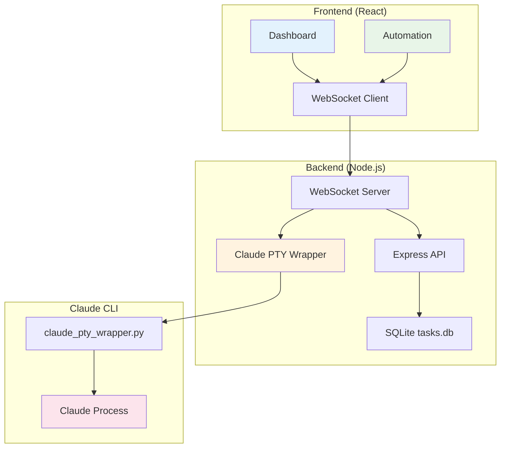

# AreYouJ Project Documentation

## 📋 프로젝트 개요

**AreYouJ** - Claude Code 자동화 플랫폼
사용자가 Claude에게 작업을 지시하고, 실시간으로 모니터링할 수 있는 로컬 개발 환경

### 🎯 핵심 기능
- **메시지 큐 시스템**: 사용자가 Claude에게 보낼 메시지를 큐에 등록하고 순차 처리
- **실시간 터미널 모니터링**: Claude의 작업 과정을 실시간으로 확인
- **프로젝트 경로 설정**: 작업할 프로젝트 디렉토리 지정 및 변경
- **WebSocket 통신**: 프론트엔드-백엔드 간 실시간 데이터 동기화

### 🚀 사용 방법
1. `npm run dev:full` - 프론트엔드/백엔드 서버 동시 실행
2. 브라우저에서 ProjectHomePathSetting으로 작업 경로 설정
3. Dashboard에서 task 목록 확인
4. Automation에서 Claude 세션 시작 후 메시지 전송

## 🏗️ 기술 스택

### Frontend
- **React 19.1.0** + TypeScript + Vite
- **UI**: Tailwind CSS + Radix UI + Lucide Icons
- **State**: React Hooks (useState, useEffect, useCallback)
- **Real-time**: WebSocket 클라이언트 (`src/utils/websocket.ts`)

### Backend
- **Runtime**: Node.js + Express 5.1.0
- **WebSocket**: ws 8.18.3
- **Database**: SQLite3 5.1.7
- **Python Integration**: PTY 기반 Claude CLI 래퍼

### Database Schema (Multi-Agent Architecture)
```sql
-- docs/tasks.db (업무 목록 전용)
CREATE TABLE tasks (
  id INTEGER PRIMARY KEY AUTOINCREMENT,
  title TEXT NOT NULL,
  description TEXT,
  status TEXT DEFAULT 'pending',
  priority TEXT DEFAULT 'medium',
  created_at DATETIME DEFAULT CURRENT_TIMESTAMP,
  updated_at DATETIME DEFAULT CURRENT_TIMESTAMP
);

-- docs/agents.db (에이전트 시스템 전용) - 계획 중
CREATE TABLE agents (
  id TEXT PRIMARY KEY,
  name TEXT NOT NULL UNIQUE,
  project_path TEXT NOT NULL,
  description TEXT,
  created_at DATETIME DEFAULT CURRENT_TIMESTAMP,
  updated_at DATETIME DEFAULT CURRENT_TIMESTAMP
);
-- + agent_instances, agent_messages, agent_settings tables
```

## 📁 주요 파일 구조

### Core Files
```
AreYouJ/
├── 🔧 package.json                 # 의존성 및 스크립트
├── 🗂️ server/
│   ├── index.js                    # Express 서버 + WebSocket 핸들러
│   ├── data/settings.json          # 프로젝트 경로 설정
│   ├── claude/claude_pty_wrapper.py # Claude CLI PTY 래퍼
│   └── websocket/index.js          # WebSocket 이벤트 핸들러
├── 🖼️ src/
│   ├── App.tsx                     # 메인 앱 (Dashboard/Automation 탭)
│   ├── components/
│   │   ├── Dashboard.tsx           # Task 목록 및 통계
│   │   ├── Automation.tsx          # 메시지 큐 + Claude 터미널
│   │   └── ProjectHomePathSetting.tsx # 프로젝트 경로 설정
│   └── utils/
│       ├── websocket.ts            # WebSocket 클라이언트
│       ├── claude-terminal.ts      # 터미널 출력 렌더링
│       └── api.ts                  # REST API 클라이언트
└── 📋 docs/tasks.db                # SQLite 데이터베이스
```

### Key Components Deep Dive

#### `src/components/Automation.tsx` (핵심 컴포넌트)
- **메시지 큐 관리**: 큐에 메시지 추가/수정/삭제
- **Claude 세션 제어**: 세션 시작/종료, 키 전송
- **실시간 터미널**: Claude 출력을 ANSI 색상으로 렌더링
- **알림 시스템**: 브라우저 푸시 알림으로 작업 상태 변경 통지

#### `server/claude/claude_pty_wrapper.py`
- **PTY 통신**: Claude CLI와 pseudoterminal을 통한 양방향 통신
- **크로스 플랫폼**: Windows (WSL), macOS, Linux 지원
- **스트림 처리**: stdin/stdout 실시간 처리

#### `server/websocket/index.js`
- **실시간 이벤트**: `queue-update`, `claude-output`, `session-status`
- **메시지 브로드캐스트**: 모든 연결된 클라이언트에게 상태 변경 전파

## 🔄 현재 아키텍처



**현재 제약사항:**
- 단일 Claude 세션만 지원
- 하나의 프로젝트 경로만 설정 가능
- 순차적인 메시지 처리만 가능

**향후 Multi-Agent 확장 계획:**
- 🔄 **Database Separation**: tasks.db + agents.db 분리 아키텍처
- 🤖 **Multiple Agents**: 여러 에이전트 동시 실행 지원
- 📁 **Multi-Project**: 프로젝트별 독립적인 에이전트 실행

## 🔧 개발 환경

### 실행 명령어
```bash
# 전체 서버 실행 (권장)
npm run dev:full

# 개별 실행
npm run dev          # Frontend only
npm run dev:server   # Backend only

# 기타
npm run build        # Production 빌드
npm run lint         # ESLint 실행
npm test             # Jest 테스트 실행
```

### 환경 요구사항
- Node.js 18+
- Python 3.8+ (Claude PTY 래퍼용)
- Claude CLI 설치 필수
- SQLite 3

## 📝 팀 작업 방식

- **언어**: 한국어 우선 (문서/코멘트)
- **사고과정**: 단계별 접근 방식 선호
- **해결책**: 실용적이고 구체적인 솔루션 중심
- **코드 리뷰**: 'why'와 'how' 설명 중시

---

> **마지막 업데이트**: 2025-08-22  
> **현재 상태**: Single Agent System (안정 운영 중)